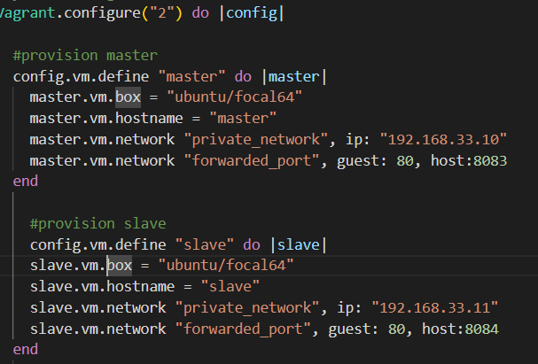

# setting up the LAMP environment

## setting up the master and slave servers
using the vagrant file below, we can set up the master and slave servers

- After configuration, we can run the command `vagrant up` to start the servers
- We can then ssh into the servers using the command `vagrant ssh master` and `vagrant ssh slave` respectively

## setting up and connecting via ssh from master to slave 
