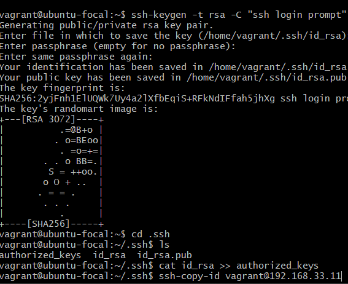
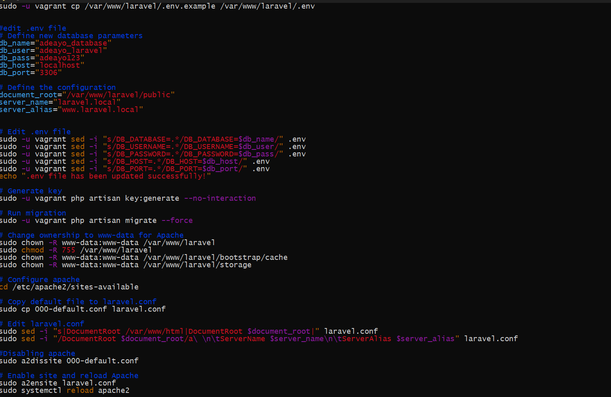
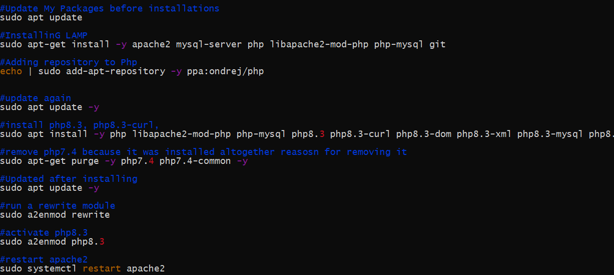
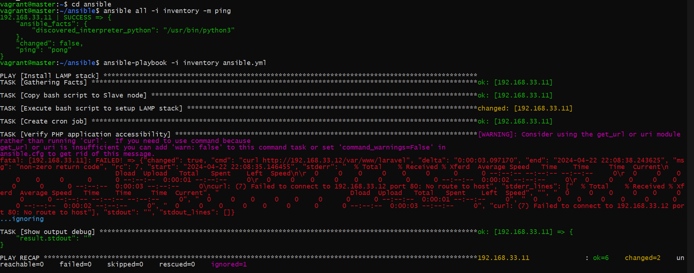
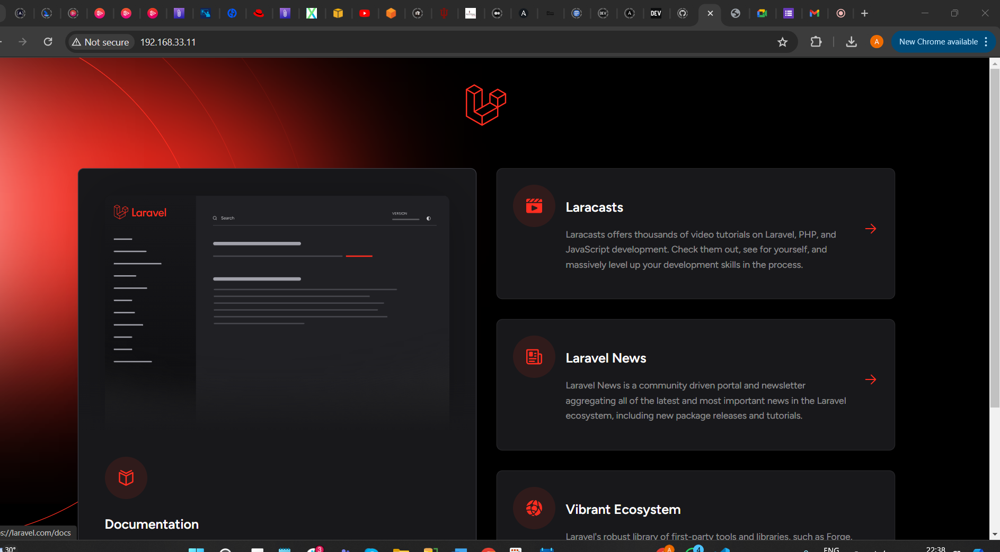

# setting up the LAMP environment

## setting up the master and slave servers
using the vagrant file below, we can set up the master and slave servers

- After configuration, we can run the command `vagrant up` to start the servers
- We can then ssh into the servers using the command `vagrant ssh master` and `vagrant ssh slave` respectively

## setting up and connecting via ssh from master to slave
- We can generate an ssh key on the master server using the command `ssh-keygen`
- We can then copy the public key to the slave server using the command `ssh-copy-id vagrant@192.168.33.11`
- We can then ssh into the slave server using the command `ssh vagrant@192.168.33.11`
 

# write the bash script to automate a LAMP environment setup
- We can write a bash script to automate the setup of a LAMP environment
- The script will install apache, mysql and php on the master and slave servers
- The script will also create a database and a table on the slave server
- The script will also clone a repository from github and copy the files to the apache slave server
- The script will also configure the apache server to serve the files from the cloned repository

The code is in LAMP_install.sh

# setting up the ansible playbook
- We can write an ansible playbook to automate the setup of the LAMP environment
- we copy the bash script from the master to the slave server
- Execute the bash script on the slave server
- Create a cron job to check the server's uptime every 12 am
- check the php application accesiible from the browser

The code is in playbook.yml

# displaying the Laravel application
- serving the / page from the slave ip address 192.168.33.11

