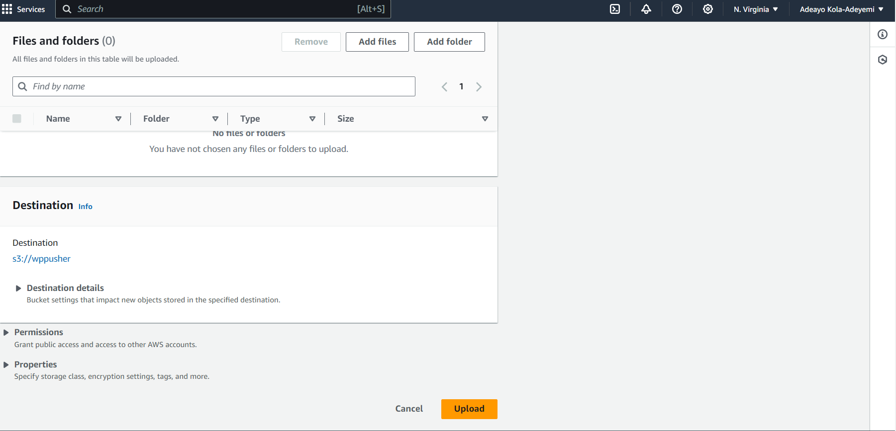

# Create an S3 bucket
- Open the Amazon S3 console at https://console.aws.amazon.com/s3/. 
- Choose Create bucket and provide a unique name for your bucket.

- choose the region where you want the bucket to be created.This is the region where the bucket will be created. This is important because the bucket name must be unique across all of Amazon S3. The region also determines the geographical location where the bucket will be stored. It is imoirtant to choose a region that is close to your users to minimize latency.
- leave the default settings and choose Create bucket.


<br/>

# Upload files to the bucket
- In the Amazon S3 console, choose the bucket that you created. and click on upload.

here in the image you will see that I have uploaded six objects. These objects are the files that I want to host on my website.
- Choose Add files and select the files that you want to upload.
- Choose Upload to upload the files to the bucket.

- After the files are uploaded, select the files and choose the Actions dropdown menu. Choose Make public to make the files public. This used to make indivial object and object end points public.

## There are two ways to make the bucket public
- Make the bucket public by setting the bucket policy to allow public read access.
- Make the bucket public by using the Block Public Access settings to allow public read access.
- The first method is the easiest way to make the bucket public. The second method is more secure because it allows you to control public access to the bucket and its contents using the Block Public Access settings.

## There are multiple ways to host on cloudfront
- Using REST API endpoints as the origin using OAI (Origin Access Identity) to restrict access to the bucket.
- Using S3 website endpoints as the origin.

## I used the second method to make the bucket public and to host the website using S3 website endpoints.

# Enable static website hosting
- In the properties tab, choose Static website hosting.
- Choose Use this bucket to host a website.
- In the Index document box, type the name of the index document for your website. This is the file that Amazon S3 returns when users access the root URL of your website. For mine, index.html.
- if you have an error document, you can specify it in the Error document box. This is the file that Amazon S3 returns when a user requests a file that is not found.error.html.
- Choose Save changes.


# Set bucket policy
- In the permissions tab, choose Bucket Policy.
- Copy and paste the following bucket policy into the Bucket policy editor. Replace the placeholder bucket-name with the name of your bucket.
```json
{
    "Version": "2012-10-17",
    "Statement": [
        {
            "Sid": "PublicReadGetObject",
            "Effect": "Allow",
            "Principal": "*",
            "Action": "s3:GetObject",
            "Resource": "arn:aws:s3:::bucket-name/*"
        }
    ]
}
```

- Choose Save changes.

# Edit block public access settings
- In the permissions tab, choose Block public access.
- Choose Edit.
- Clear the Block all public access check box.
- Choose Save changes.

- This might be insecure, but it is the easiest way to make the bucket public.

# Create a CloudFront distribution
- Depending on the size of the files that you are hosting, you may want to use Amazon CloudFront to speed up the delivery of your website to users. Amazon CloudFront is a content delivery network (CDN) that caches copies of your files in multiple locations around the world.
- Open the Amazon CloudFront console at https://console.aws.amazon.com/cloudfront/.
- Choose Create Distribution.
- Choose Get Started under the Web section.
- In the Origin Domain Name box, type the Amazon S3 website endpoint for your bucket. The Amazon S3 website endpoint is the bucket name followed by the Amazon S3 website URL. For example, bucket-name.s3-website-region.amazonaws.com.

in my case, it is wppusher.s3-website-us-east-1.amazonaws.com
- if you have a custom domain, you can specify it in the Origin ID box. This is the domain name that you want to use to access your website. I used wppusher.me
- create a custom SSL certificate for your domain. This is optional, but it is recommended if you want to use HTTPS to secure your website. AWS will provide you with a free SSL certificate if you use the AWS Certificate Manager.

- Leave the default settings and choose Create Distribution.
- After the distribution is created, you will see the domain name for your CloudFront distribution. This is the URL that you can use to access your website. For example, d123456789.cloudfront.net.

# DNS configuration
- To use your custom domain name with your CloudFront distribution, you need to update the DNS settings for your domain name to point to the CloudFront distribution.
- I used Namecheap to register my domain name, so I updated the DNS settings in the Namecheap dashboard.
- In the Namecheap dashboard, choose the domain name that you want to update.
- In the Advanced DNS tab, choose Add New Record.
- Choose CNAME Record as the record type.
- In the Host box, type the subdomain that you want to use for your website. For example, www.
- In the Value box, type the domain name for your CloudFront distribution. For example, d123456789.cloudfront.net.
- Choose Save all changes.
- It may take some time for the DNS changes to propagate, so be patient.


# Test the website
- After the DNS changes have propagated, you can test your website by entering the domain name in a web browser. For example, www.wppusher.me.
- If everything is set up correctly, you should see your website in the browser.
